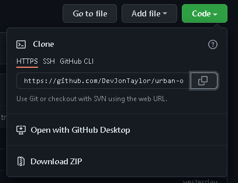

# Horiseon Code Refactor Challenge

This project's goal was refactor the code to include semantic HTML and organize/otimize 
the css.  I feel was successful as I was able to include main, section, article, and 
nav to name a few without loosing the requested mock up display.  You can reach the 
finished product [here](https://devjontaylor.github.io/urban-octo-telegram/).


## Installation

### Download Zip
You can download the zip from GitHub by clicking code button in the top right hand corner
then selecting Download Zip option a the button shown below.


### Clone
You can follow the commands below and install it this way.
```bash
  git clone https://github.com/DevJonTaylor/urban-octo-telegram.git
  cd urban-octo-telegram
```

    
## Usage/Examples

You can open the file using any browser and receive the same results. 


## License

[MIT](./LICENSE.md)

